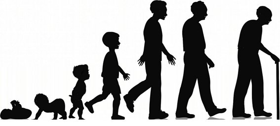
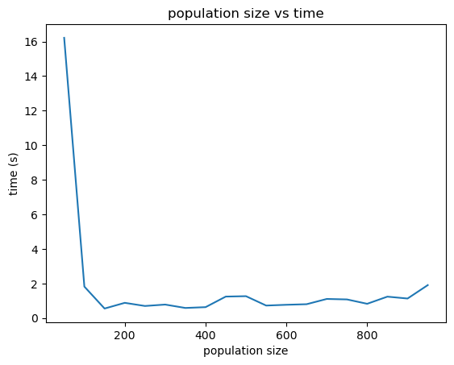

# Genetic Algorithm
## Personal project implemented using Python
### What is a Genetic Algorithm?

Image Credit - https://www.quora.com/What-are-some-known-facts-about-human-life-cycle

Algorithm description - https://en.wikipedia.org/wiki/Genetic_algorithm
### Get Started
Making use of jupyter framework. ✌

### Interepreting results
The below graph dipslays that a population of size greater than 150 required significantly lower time to train on (String) Vinayak Verma.

